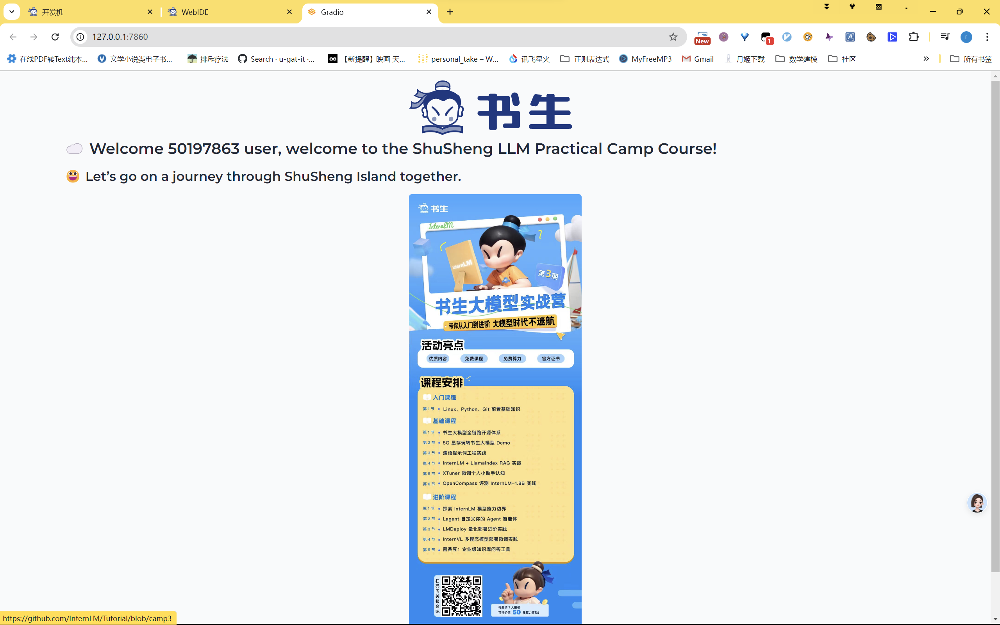

# task

使用vscode 连接远程服务器，使用ssh连接，最开始的连接通过密码，但每次打开文件后，都需要输入密码，显得很繁琐，后续通过ssh keygen生成密钥连接，提高了安全，因此后续不用在输入密码

​    因未安装gradio ，因此通过 pip install gradio 安装 ，之后通过 隧道 映射本地端口 通过localhoust:7860访问hello_world.py生成的页面
​    

