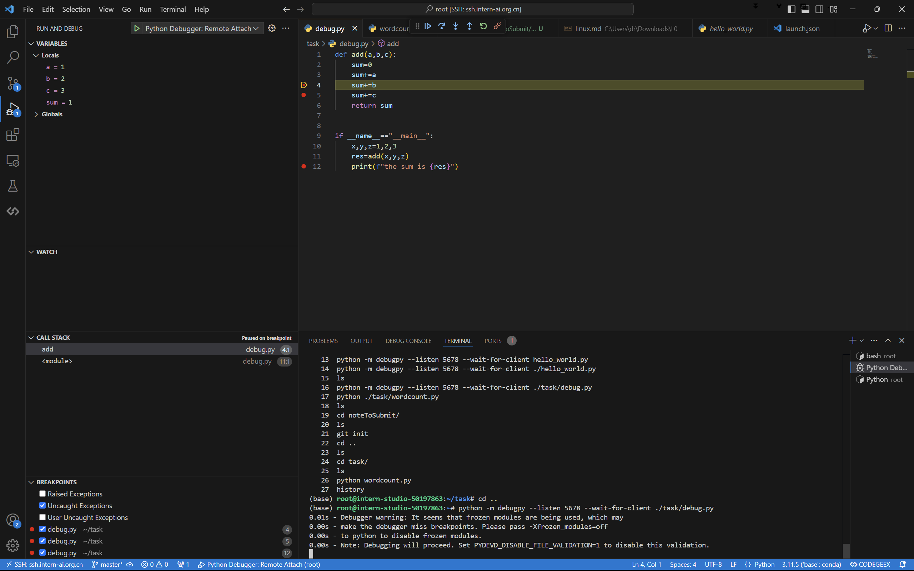
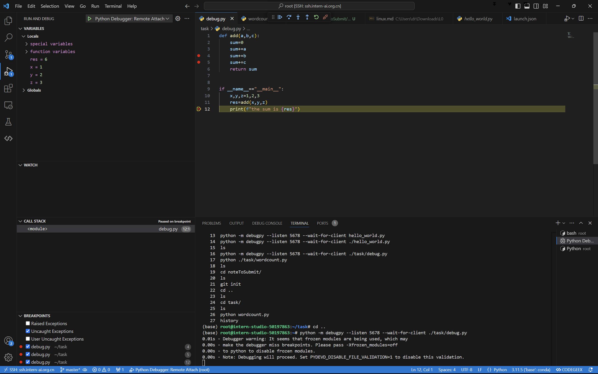
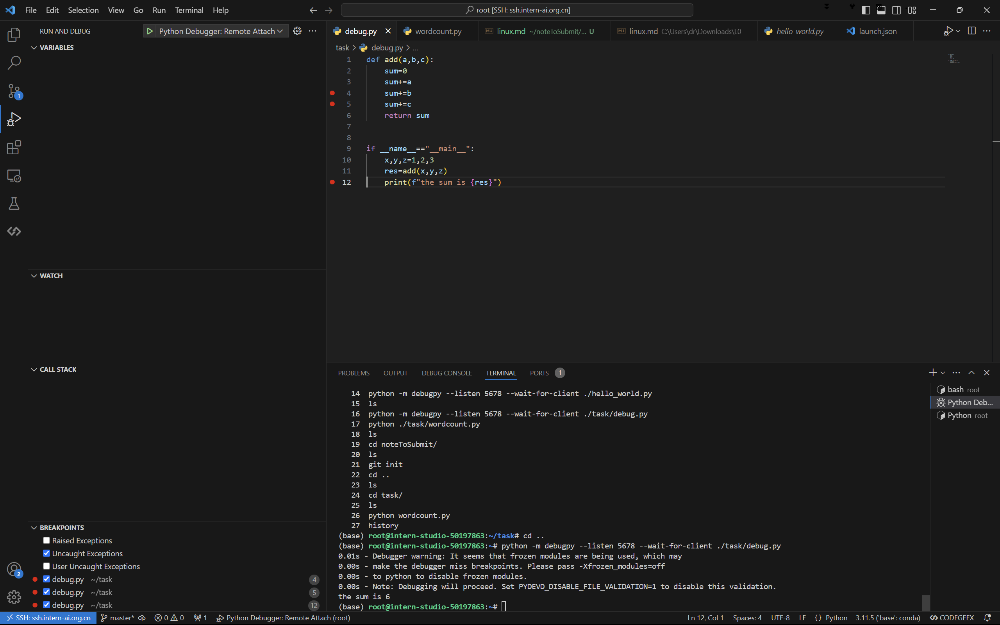

# task 1

```python
inputs = """
Got this panda plush toy for my daughter's birthday,
who loves it and takes it everywhere. It's soft and
super cute, and its face has a friendly look. It's
a bit small for what I paid though. I think there
might be other options that are bigger for the
same price. It arrived a day earlier than expected,
so I got to play with it myself before I gave it
to her.
"""

# 去除多余的空格和换行符
inputs = inputs.lower()
inputs = inputs.replace("\n", " ").strip()

words = inputs.split()        
print("Number of words:", len(words))
print(words)
print("###############")
# 统计每个单词出现的次数
word_count = {}
word_count = {word: words.count(word) for word in set(words)}

print(word_count)
print(type(word_count))


output:
    ###########
    {'who': 1, "daughter's": 1, 'might': 1, 'look.': 1, 'paid': 1, 'this': 1, 'be': 1, 'i': 4, 'cute,': 1, 'what': 1, 'other': 1, 'with': 1, 'earlier': 1, 'soft': 1, 'though.': 1, 'super': 1, 'bit': 1, 'and': 3, 'that': 1, 'so': 1, 'takes': 1, 'got': 2, 'panda': 1, 'price.': 1, 'its': 1, 'friendly': 1, 'day': 1, 'bigger': 1, 'before': 1, 'options': 1, 'it': 5, 'small': 1, 'a': 3, 'arrived': 1, 'there': 1, 'my': 1, 'to': 2, 'her.': 1, "it's": 2, 'face': 1, 'has': 1, 'everywhere.': 1, 'the': 1, 'myself': 1, 'think': 1, 'toy': 1, 'than': 1, 'play': 1, 'gave': 1, 'plush': 1, 'birthday,': 1, 'for': 3, 'loves': 1, 'same': 1, 'expected,': 1, 'are': 1}
<class 'dict'>

```

# task 2

1.通过python debug 简单 适用于不需要输入命令参数的python文件


2.一些运行的main文件需要输入参数，为了通过命令行输入 参数， 需要设置一个remote server 作为中继 从而实现 配置参数的输入

通过建立remote config 文件 ，之后通过以下命令运行，后面可根据具体文件要求输入参数

```python
python -m debugpy --listen 5678 --wait-for-client ./task/debug.py --<config>
```






