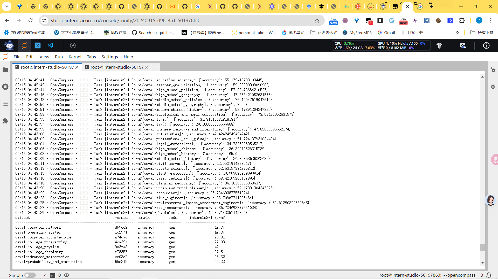
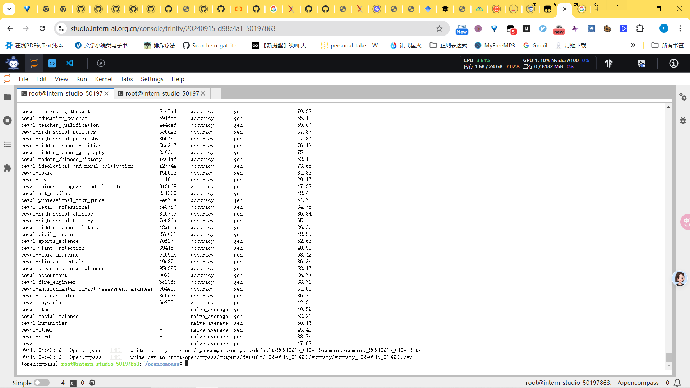

# 1 使用命令行配置参数法进行评测

~~~ python
# 模型参数设置
from opencompass.models import HuggingFaceCausalLM

models = [
    dict(
        type=HuggingFaceCausalLM,
        abbr='internlm2-1.8b-hf',
        path="/share/new_models/Shanghai_AI_Laboratory/internlm2-chat-1_8b",
        tokenizer_path='/share/new_models/Shanghai_AI_Laboratory/internlm2-chat-1_8b',
        model_kwargs=dict(
            trust_remote_code=True,
            device_map='auto',
        ),
        tokenizer_kwargs=dict(
            padding_side='left',
            truncation_side='left',
            use_fast=False,
            trust_remote_code=True,
        ),
        max_out_len=100,
        min_out_len=1,
        max_seq_len=2048,
        batch_size=8,
        run_cfg=dict(num_gpus=1, num_procs=1),
    )
]

# cmd 命令解析
python run.py
--datasets ceval_gen \ # 数据集准备
--models hf_internlm2_chat_1_8b \  # 模型准备
--debug
~~~

# 2 使用配置文件修改参数法进行评测

~~~ python
#   eval_tutorial_demo.py
from mmengine.config import read_base

with read_base():
    from .datasets.ceval.ceval_gen import ceval_datasets
    from .models.hf_internlm.hf_internlm2_chat_1_8b import models as hf_internlm2_chat_1_8b_models

datasets = ceval_datasets
models = hf_internlm2_chat_1_8b_models

# 通过文件导入参数
cd /root/opencompass
python run.py configs/eval_tutorial_demo.py --debug

~~~

# 3 输出信息

~~~ python 

09/15 04:41:49 - OpenCompass - INFO - time elapsed: 12786.13s
09/15 04:41:55 - OpenCompass - INFO - Partitioned into 52 tasks.
09/15 04:41:57 - OpenCompass - INFO - Task [internlm2-1.8b-hf/ceval-computer_network]: {'accuracy': 47.368421052631575}
09/15 04:41:59 - OpenCompass - INFO - Task [internlm2-1.8b-hf/ceval-operating_system]: {'accuracy': 47.368421052631575}
09/15 04:42:01 - OpenCompass - INFO - Task [internlm2-1.8b-hf/ceval-computer_architecture]: {'accuracy': 23.809523809523807}
09/15 04:42:03 - OpenCompass - INFO - Task [internlm2-1.8b-hf/ceval-college_programming]: {'accuracy': 27.027027027027028}
09/15 04:42:05 - OpenCompass - INFO - Task [internlm2-1.8b-hf/ceval-college_physics]: {'accuracy': 42.10526315789473}
09/15 04:42:06 - OpenCompass - INFO - Task [internlm2-1.8b-hf/ceval-college_chemistry]: {'accuracy': 37.5}
09/15 04:42:08 - OpenCompass - INFO - Task [internlm2-1.8b-hf/ceval-advanced_mathematics]: {'accuracy': 26.31578947368421}
09/15 04:42:10 - OpenCompass - INFO - Task [internlm2-1.8b-hf/ceval-probability_and_statistics]: {'accuracy': 22.22222222222222}
09/15 04:42:12 - OpenCompass - INFO - Task [internlm2-1.8b-hf/ceval-discrete_mathematics]: {'accuracy': 25.0}
09/15 04:42:14 - OpenCompass - INFO - Task [internlm2-1.8b-hf/ceval-electrical_engineer]: {'accuracy': 27.027027027027028}
09/15 04:42:15 - OpenCompass - INFO - Task [internlm2-1.8b-hf/ceval-metrology_engineer]: {'accuracy': 54.166666666666664}
09/15 04:42:17 - OpenCompass - INFO - Task [internlm2-1.8b-hf/ceval-high_school_mathematics]: {'accuracy': 22.22222222222222}
09/15 04:42:19 - OpenCompass - INFO - Task [internlm2-1.8b-hf/ceval-high_school_physics]: {'accuracy': 42.10526315789473}
09/15 04:42:21 - OpenCompass - INFO - Task [internlm2-1.8b-hf/ceval-high_school_chemistry]: {'accuracy': 52.63157894736842}
09/15 04:42:23 - OpenCompass - INFO - Task [internlm2-1.8b-hf/ceval-high_school_biology]: {'accuracy': 26.31578947368421}
09/15 04:42:24 - OpenCompass - INFO - Task [internlm2-1.8b-hf/ceval-middle_school_mathematics]: {'accuracy': 36.84210526315789}
09/15 04:42:26 - OpenCompass - INFO - Task [internlm2-1.8b-hf/ceval-middle_school_biology]: {'accuracy': 80.95238095238095}
09/15 04:42:28 - OpenCompass - INFO - Task [internlm2-1.8b-hf/ceval-middle_school_physics]: {'accuracy': 47.368421052631575}
09/15 04:42:30 - OpenCompass - INFO - Task [internlm2-1.8b-hf/ceval-middle_school_chemistry]: {'accuracy': 80.0}
09/15 04:42:32 - OpenCompass - INFO - Task [internlm2-1.8b-hf/ceval-veterinary_medicine]: {'accuracy': 43.47826086956522}
09/15 04:42:33 - OpenCompass - INFO - Task [internlm2-1.8b-hf/ceval-college_economics]: {'accuracy': 32.72727272727273}
09/15 04:42:35 - OpenCompass - INFO - Task [internlm2-1.8b-hf/ceval-business_administration]: {'accuracy': 39.39393939393939}
09/15 04:42:37 - OpenCompass - INFO - Task [internlm2-1.8b-hf/ceval-marxism]: {'accuracy': 68.42105263157895}
09/15 04:42:39 - OpenCompass - INFO - Task [internlm2-1.8b-hf/ceval-mao_zedong_thought]: {'accuracy': 70.83333333333334}
09/15 04:42:41 - OpenCompass - INFO - Task [internlm2-1.8b-hf/ceval-education_science]: {'accuracy': 55.172413793103445}
09/15 04:42:42 - OpenCompass - INFO - Task [internlm2-1.8b-hf/ceval-teacher_qualification]: {'accuracy': 59.09090909090909}
09/15 04:42:44 - OpenCompass - INFO - Task [internlm2-1.8b-hf/ceval-high_school_politics]: {'accuracy': 57.89473684210527}
09/15 04:42:46 - OpenCompass - INFO - Task [internlm2-1.8b-hf/ceval-high_school_geography]: {'accuracy': 47.368421052631575}
09/15 04:42:48 - OpenCompass - INFO - Task [internlm2-1.8b-hf/ceval-middle_school_politics]: {'accuracy': 76.19047619047619}
09/15 04:42:50 - OpenCompass - INFO - Task [internlm2-1.8b-hf/ceval-middle_school_geography]: {'accuracy': 75.0}
09/15 04:42:51 - OpenCompass - INFO - Task [internlm2-1.8b-hf/ceval-modern_chinese_history]: {'accuracy': 52.17391304347826}
09/15 04:42:53 - OpenCompass - INFO - Task [internlm2-1.8b-hf/ceval-ideological_and_moral_cultivation]: {'accuracy': 73.68421052631578}
09/15 04:42:55 - OpenCompass - INFO - Task [internlm2-1.8b-hf/ceval-logic]: {'accuracy': 31.818181818181817}
09/15 04:42:57 - OpenCompass - INFO - Task [internlm2-1.8b-hf/ceval-law]: {'accuracy': 29.166666666666668}
09/15 04:42:59 - OpenCompass - INFO - Task [internlm2-1.8b-hf/ceval-chinese_language_and_literature]: {'accuracy': 47.82608695652174}
09/15 04:43:00 - OpenCompass - INFO - Task [internlm2-1.8b-hf/ceval-art_studies]: {'accuracy': 42.42424242424242}
09/15 04:43:02 - OpenCompass - INFO - Task [internlm2-1.8b-hf/ceval-professional_tour_guide]: {'accuracy': 51.724137931034484}
09/15 04:43:04 - OpenCompass - INFO - Task [internlm2-1.8b-hf/ceval-legal_professional]: {'accuracy': 34.78260869565217}
09/15 04:43:06 - OpenCompass - INFO - Task [internlm2-1.8b-hf/ceval-high_school_chinese]: {'accuracy': 36.84210526315789}
09/15 04:43:08 - OpenCompass - INFO - Task [internlm2-1.8b-hf/ceval-high_school_history]: {'accuracy': 65.0}
09/15 04:43:09 - OpenCompass - INFO - Task [internlm2-1.8b-hf/ceval-middle_school_history]: {'accuracy': 86.36363636363636}
09/15 04:43:11 - OpenCompass - INFO - Task [internlm2-1.8b-hf/ceval-civil_servant]: {'accuracy': 42.5531914893617}
09/15 04:43:13 - OpenCompass - INFO - Task [internlm2-1.8b-hf/ceval-sports_science]: {'accuracy': 52.63157894736842}
09/15 04:43:15 - OpenCompass - INFO - Task [internlm2-1.8b-hf/ceval-plant_protection]: {'accuracy': 40.909090909090914}
09/15 04:43:16 - OpenCompass - INFO - Task [internlm2-1.8b-hf/ceval-basic_medicine]: {'accuracy': 68.42105263157895}
09/15 04:43:18 - OpenCompass - INFO - Task [internlm2-1.8b-hf/ceval-clinical_medicine]: {'accuracy': 36.36363636363637}
09/15 04:43:20 - OpenCompass - INFO - Task [internlm2-1.8b-hf/ceval-urban_and_rural_planner]: {'accuracy': 52.17391304347826}
09/15 04:43:22 - OpenCompass - INFO - Task [internlm2-1.8b-hf/ceval-accountant]: {'accuracy': 36.734693877551024}
09/15 04:43:23 - OpenCompass - INFO - Task [internlm2-1.8b-hf/ceval-fire_engineer]: {'accuracy': 38.70967741935484}
09/15 04:43:25 - OpenCompass - INFO - Task [internlm2-1.8b-hf/ceval-environmental_impact_assessment_engineer]: {'accuracy': 51.61290322580645}
09/15 04:43:27 - OpenCompass - INFO - Task [internlm2-1.8b-hf/ceval-tax_accountant]: {'accuracy': 36.734693877551024}
09/15 04:43:29 - OpenCompass - INFO - Task [internlm2-1.8b-hf/ceval-physician]: {'accuracy': 42.857142857142854}
dataset                                         version    metric         mode      internlm2-1.8b-hf
----------------------------------------------  ---------  -------------  ------  -------------------
ceval-computer_network                          db9ce2     accuracy       gen                   47.37
ceval-operating_system                          1c2571     accuracy       gen                   47.37
ceval-computer_architecture                     a74dad     accuracy       gen                   23.81
ceval-college_programming                       4ca32a     accuracy       gen                   27.03
ceval-college_physics                           963fa8     accuracy       gen                   42.11
ceval-college_chemistry                         e78857     accuracy       gen                   37.5
ceval-advanced_mathematics                      ce03e2     accuracy       gen                   26.32
ceval-probability_and_statistics                65e812     accuracy       gen                   22.22
ceval-discrete_mathematics                      e894ae     accuracy       gen                   25
ceval-electrical_engineer                       ae42b9     accuracy       gen                   27.03
ceval-metrology_engineer                        ee34ea     accuracy       gen                   54.17
ceval-high_school_mathematics                   1dc5bf     accuracy       gen                   22.22
ceval-high_school_physics                       adf25f     accuracy       gen                   42.11
ceval-high_school_chemistry                     2ed27f     accuracy       gen                   52.63
ceval-high_school_biology                       8e2b9a     accuracy       gen                   26.32
ceval-middle_school_mathematics                 bee8d5     accuracy       gen                   36.84
ceval-middle_school_biology                     86817c     accuracy       gen                   80.95
ceval-middle_school_physics                     8accf6     accuracy       gen                   47.37
ceval-middle_school_chemistry                   167a15     accuracy       gen                   80
ceval-veterinary_medicine                       b4e08d     accuracy       gen                   43.48
ceval-college_economics                         f3f4e6     accuracy       gen                   32.73
ceval-business_administration                   c1614e     accuracy       gen                   39.39
ceval-marxism                                   cf874c     accuracy       gen                   68.42
ceval-mao_zedong_thought                        51c7a4     accuracy       gen                   70.83
ceval-education_science                         591fee     accuracy       gen                   55.17
ceval-teacher_qualification                     4e4ced     accuracy       gen                   59.09
ceval-high_school_politics                      5c0de2     accuracy       gen                   57.89
ceval-high_school_geography                     865461     accuracy       gen                   47.37
ceval-middle_school_politics                    5be3e7     accuracy       gen                   76.19
ceval-middle_school_geography                   8a63be     accuracy       gen                   75
ceval-modern_chinese_history                    fc01af     accuracy       gen                   52.17
ceval-ideological_and_moral_cultivation         a2aa4a     accuracy       gen                   73.68
ceval-logic                                     f5b022     accuracy       gen                   31.82
ceval-law                                       a110a1     accuracy       gen                   29.17
ceval-chinese_language_and_literature           0f8b68     accuracy       gen                   47.83
ceval-art_studies                               2a1300     accuracy       gen                   42.42
ceval-professional_tour_guide                   4e673e     accuracy       gen                   51.72
ceval-legal_professional                        ce8787     accuracy       gen                   34.78
ceval-high_school_chinese                       315705     accuracy       gen                   36.84
ceval-high_school_history                       7eb30a     accuracy       gen                   65
ceval-middle_school_history                     48ab4a     accuracy       gen                   86.36
ceval-civil_servant                             87d061     accuracy       gen                   42.55
ceval-sports_science                            70f27b     accuracy       gen                   52.63
ceval-plant_protection                          8941f9     accuracy       gen                   40.91
ceval-basic_medicine                            c409d6     accuracy       gen                   68.42
ceval-clinical_medicine                         49e82d     accuracy       gen                   36.36
ceval-urban_and_rural_planner                   95b885     accuracy       gen                   52.17
ceval-accountant                                002837     accuracy       gen                   36.73
ceval-fire_engineer                             bc23f5     accuracy       gen                   38.71
ceval-environmental_impact_assessment_engineer  c64e2d     accuracy       gen                   51.61
ceval-tax_accountant                            3a5e3c     accuracy       gen                   36.73
ceval-physician                                 6e277d     accuracy       gen                   42.86
ceval-stem                                      -          naive_average  gen                   40.59
ceval-social-science                            -          naive_average  gen                   58.21
ceval-humanities                                -          naive_average  gen                   50.16
ceval-other                                     -          naive_average  gen                   45.43
ceval-hard                                      -          naive_average  gen                   33.76
ceval                                           -          naive_average  gen                   47.03

~~~

在A100 10%下 09/15 01:18:39开始，[2024-09-15 04:40:04 结束

