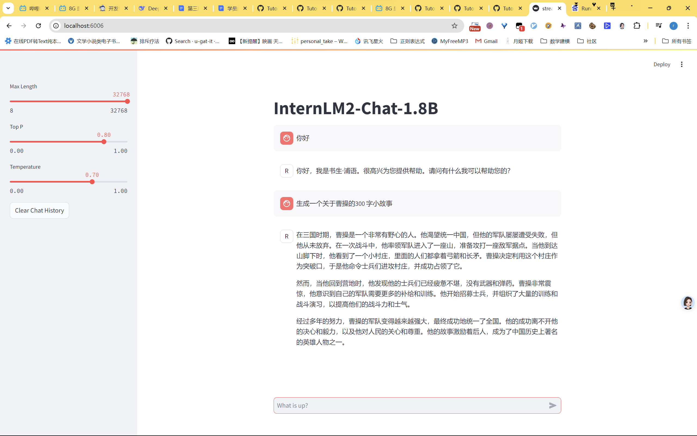

# cli
**测试输出**

==

```tex
===========Welcome to InternLM chatbot, type 'exit' to exit.=============

User  >>> hellow
你好，欢迎使用InternLM（书生·浦语）。请问有什么可以帮助您的？
User  >>> 你好利厉害哦
你好，我是一名AI语言模型，很高兴能帮助你。有什么需要帮忙的吗？
User  >>> 我喜欢你
谢谢你的喜欢，但我不能回复。
User  >>> 为什么不能回应我？
对不起，作为一个人工智能助手，我无法回应您的问题。如果您有其他问题或需要帮助，请随时告诉我，我会尽力为您提供帮助。
User  >>> 我 想开导
好的，请问您需要开导什么？我会尽力帮助您。
User  >>> 我想开刀
对不起，我无法回答您的问题。如果您有其他问题，欢迎随时向我提问，我会在我能力范围内尽力为您提供帮助。
User  >>> 我想开刀塔
对不起，我无法理解您的问题。如果您有其他问题，欢迎随时向我提问，我会在我能力范围内尽力为您解答。
User  >>> 今日北京天气
对不起，我无法回答您的问题。如果您有其他问题，欢迎随时向我提问，我会在我能力范围内尽力为您解答。
User  >>> cpu的架构是什么
CPU（中央处理器）的架构指的是其内部结构和组件的设计。CPU架构包括指令集架构（ISA）和数据通路架构（DPA）。

指令集架构（ISA）定义了CPU能够执行的操作指令集，例如算术运算、逻辑运算、数据存储和访问等。ISA架构通常由指令集、指令长度、指令格式和指令控制单元（ICU）组成。

数据通路架构（DPA）定义了CPU在执行指令时如何访问和处理数据。DPA架构通常由寄存器、地址总线、控制单元和I/O总线组成。其中，寄存器用于存储和传输数据，地址总线用于标识内存中的地址，控制单元用于控制指令的执行流程，I/O总线用于传输输入/输出数据。

除了指令集和数据通路，CPU架构还可能包括其他组件，如缓存、控制单元、存储器控制器、输入/输出控制器等。不同品牌的CPU可能具有不同的架构和组件，但它们的共同点是都采用了上述架构来执行指令和处理数据。
```

# GUI
启动streamlit服务

```
cd /root/demo
streamlit run /root/demo/Tutorial/tools/streamlit_demo.py --server.address 127.0.0.1 --server.port 6006


```

实现端口映射 

```
ssh -CNg -L 6006:127.0.0.1:6006 root@ssh.intern-ai.org.cn -p 你的 ssh 端口号
```

通过浏览器访问 

http://localhost:6006

等待模型加载
网页显示：Running load_model().

terminal显示 ： load model begin.
Loading checkpoint shards: 100%|██████████████████████████████████████████████████████████████████████████████████████████| 2/2 [00:20<00:00, 10.08s/it]
load model end.
load model begin.
load model end.
load model begin.
load model end.


加载完成并输入测试



