# 概览
1. 2023.7.6 开源internLM-7B
2. 2023.9.20 开源internLM-20B
3. 2024.1.17internLM-20B性能超同等模型
4. 2023.7.4开源internLM2.5

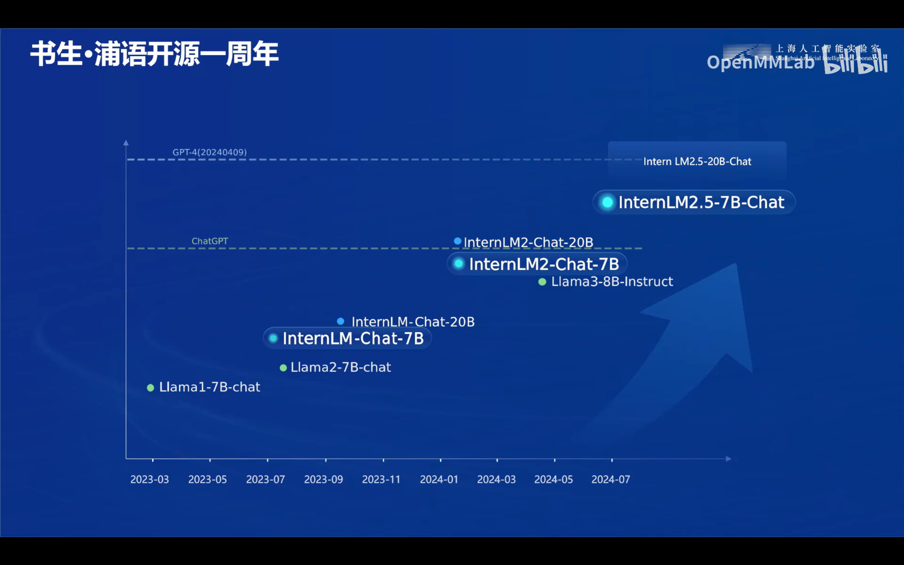

**2.5的突出能力**
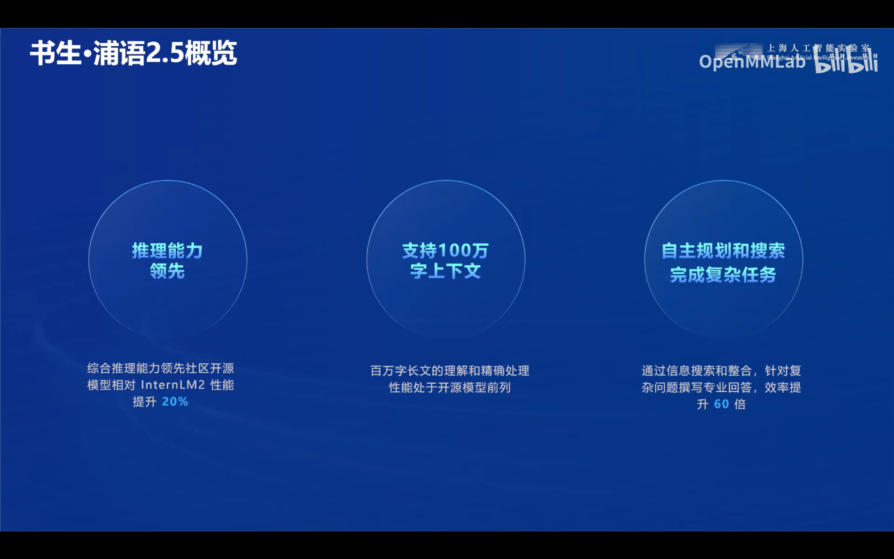

**不断的改进**
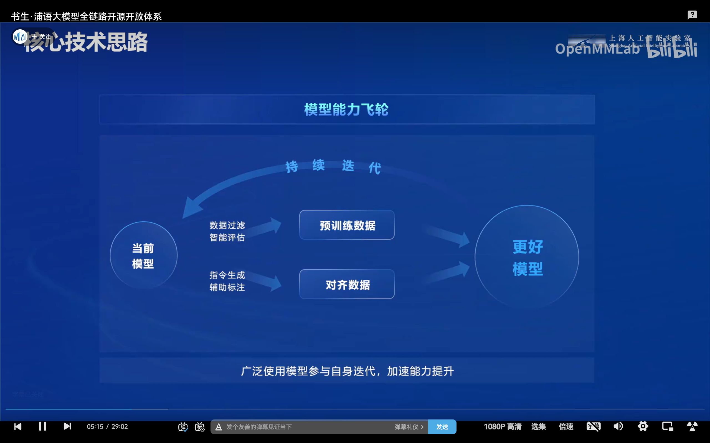

**数据获取**
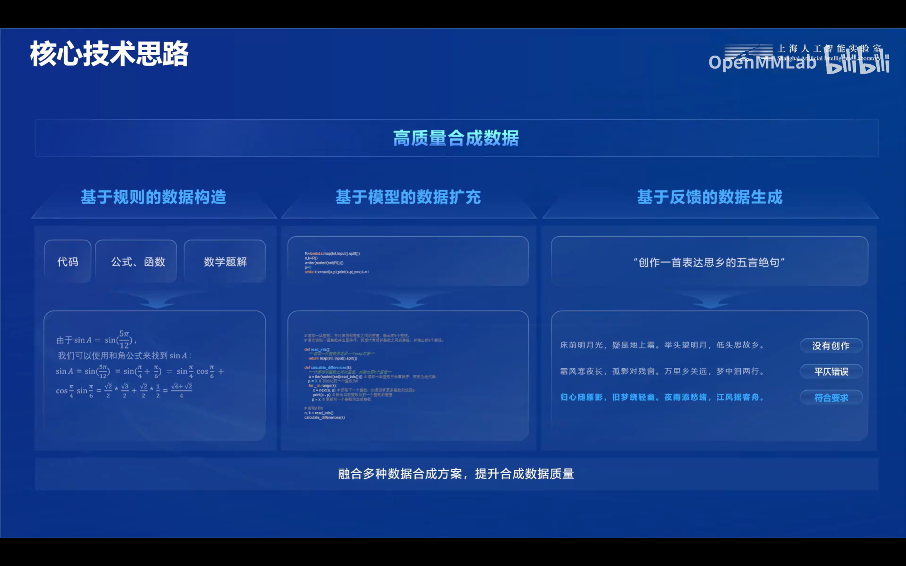

**在海量数据中获得目标信息的能力**
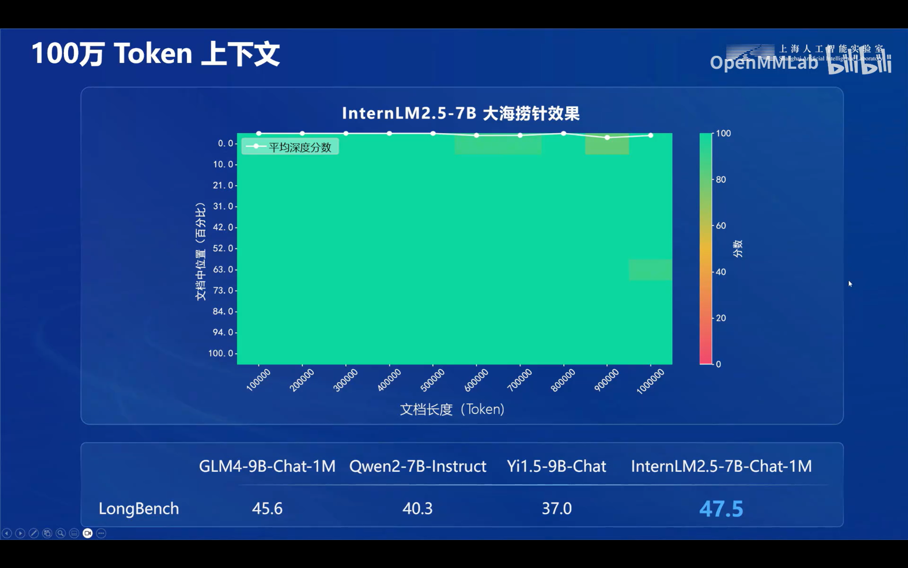

**丰富的开发生态**
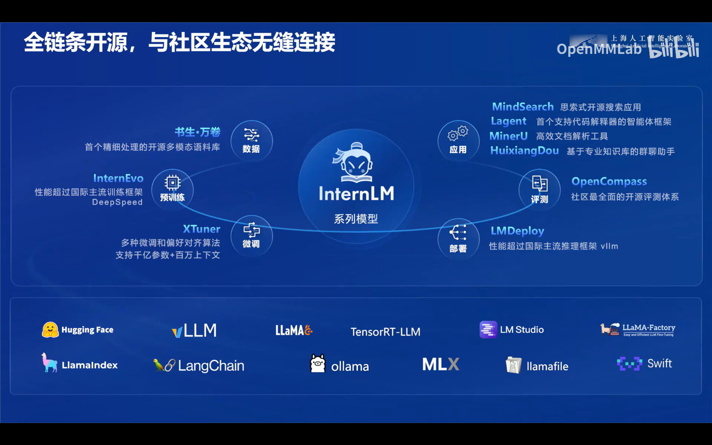

**海量数据集**

**数据标注**
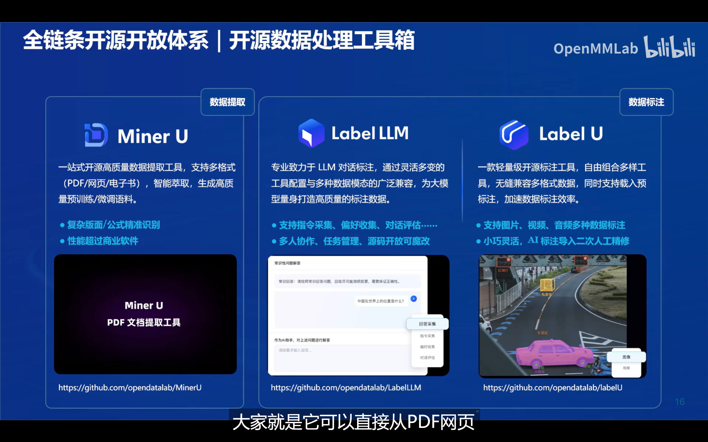

**预训练**
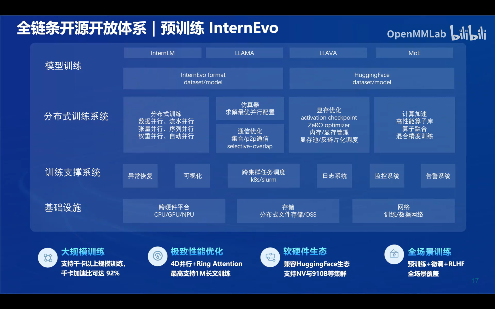

**微调**
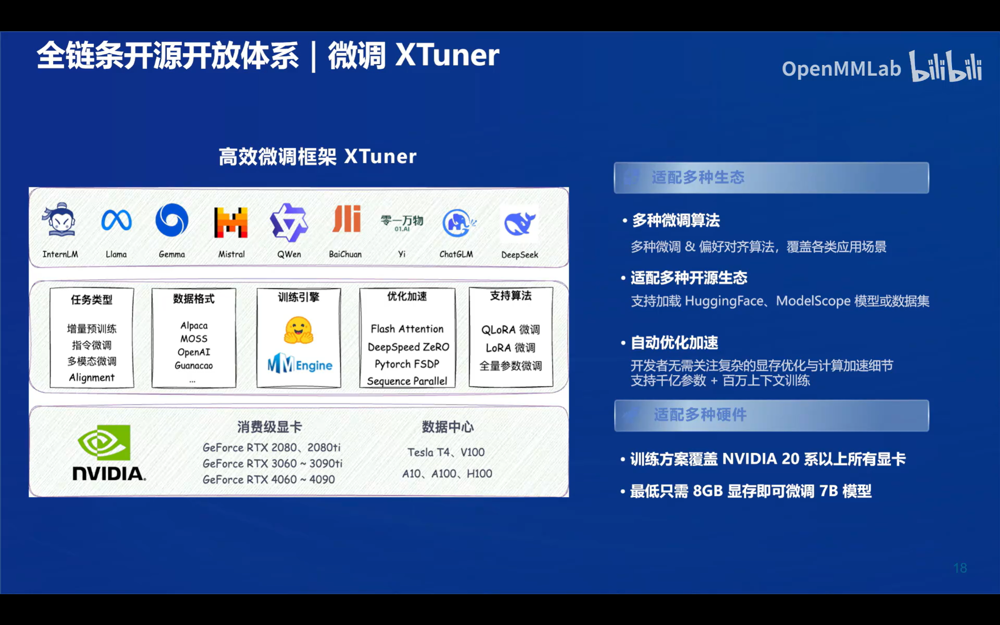

**评测指标**
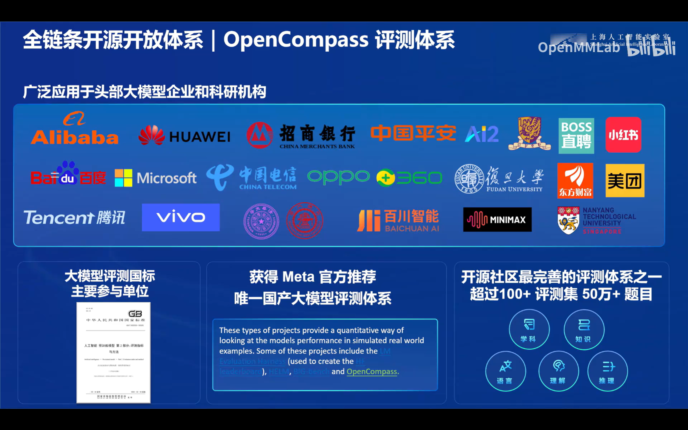

**部署**
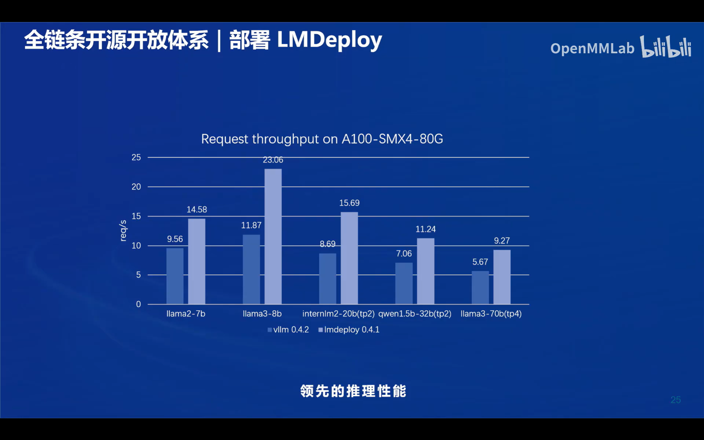