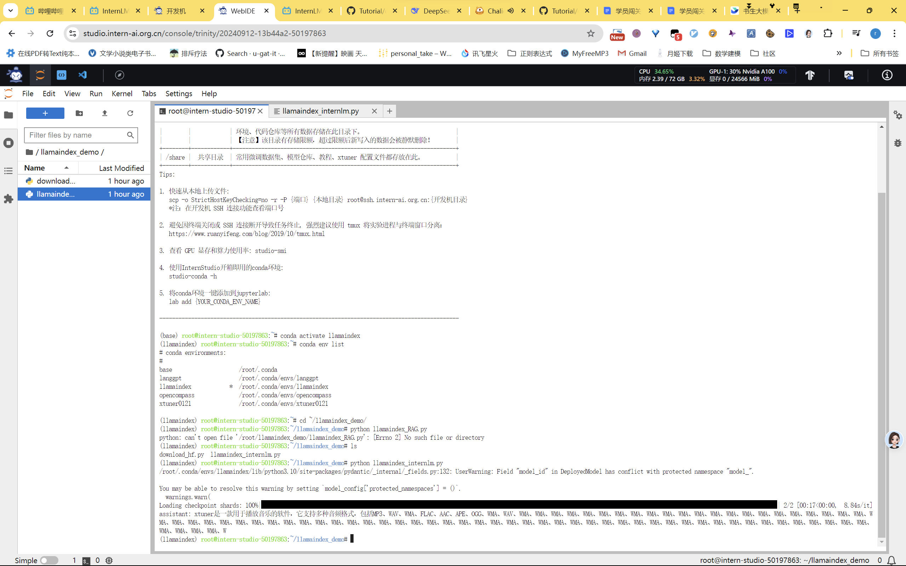
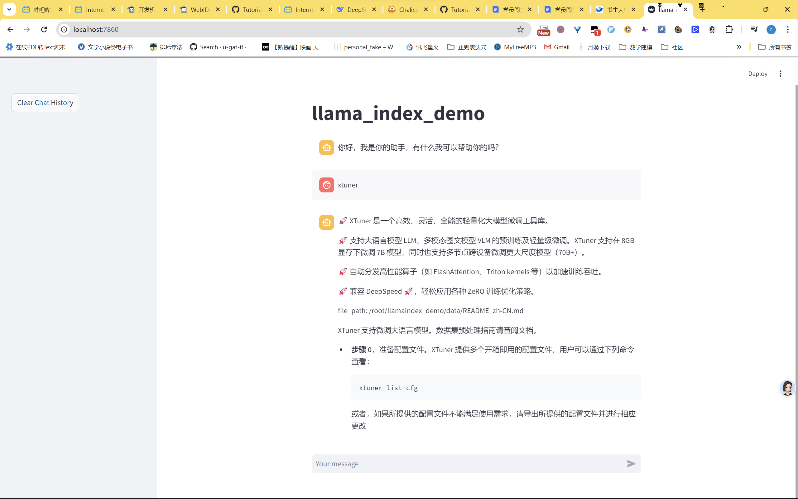
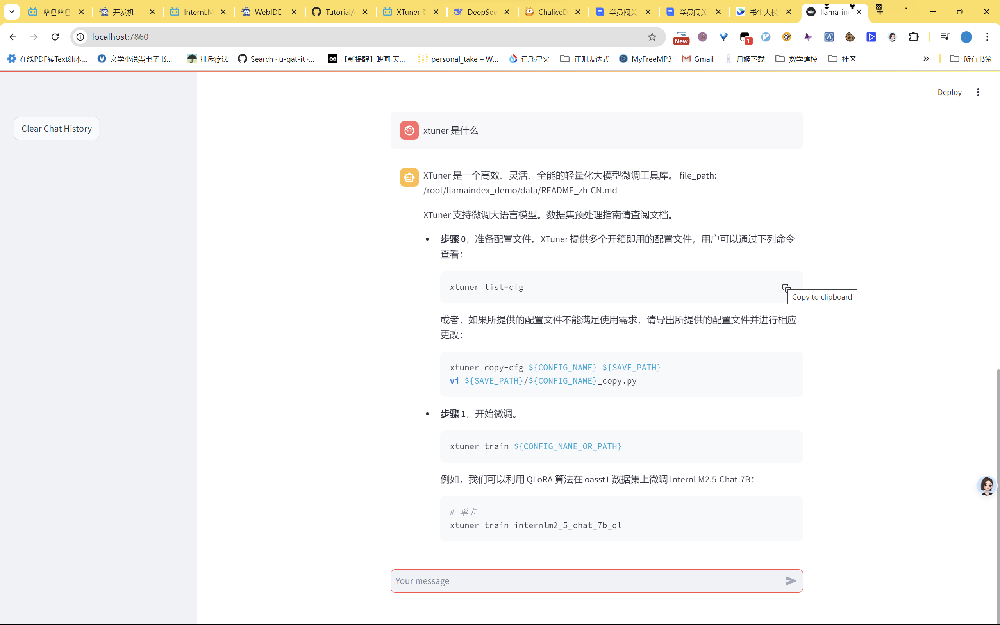

# RAG(Retrieval-Augmented Generation)

RAG（Retrieval-Augmented Generation）作为一种结合信息检索和文本生成技术的方法，在大模型（如GPT-3、GPT-4等）中发挥着至关重要的作用。它通过检索外部知识库，为模型提供丰富的上下文信息，从而增强上下文理解，减少幻觉现象，提高生成文本的准确性和一致性。RAG不仅能够实时更新数据，确保内容与当前事实一致，还能根据用户需求检索特定领域的知识，生成更具专业性和针对性的文本，实现个性化和定制化。此外，RAG通过外部检索补充信息，降低了模型的规模和复杂度，减少了计算成本和推理时间，提高了整体效率。它还增强了生成过程的透明性和可追溯性，使用户更容易理解模型的决策过程。在处理稀有知识和多模态任务时，RAG同样表现出色，能够帮助大模型应对长尾问题，检索跨模态数据，进一步提升模型的综合能力。随着技术的不断进步，RAG有望在大模型应用中发挥越来越重要的作用，推动生成式人工智能向更高质量、更高效率和更高可解释性的方向发展。

# rag前无法回答xtuner

# rag后回答

