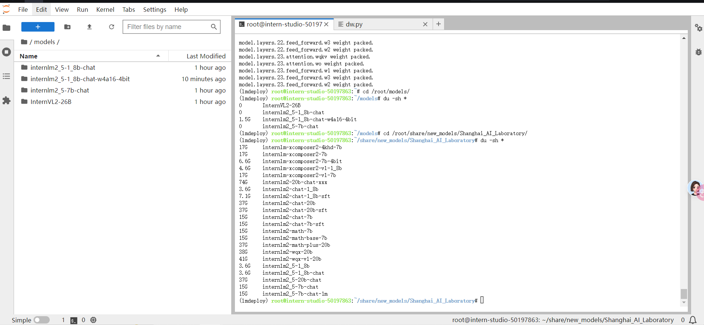
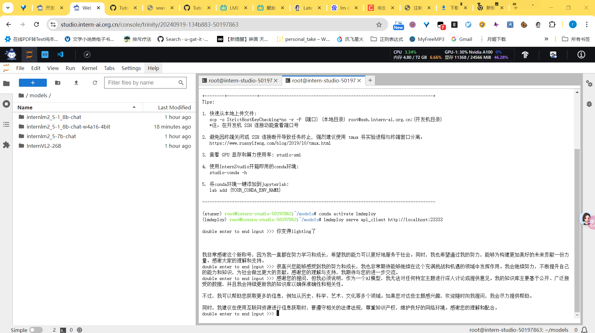

# deploy
将训练好的深度学习模型在**特定环境中运行**的过程

# kv cache

迭代产生token时，除最新产生的token外，其余加入计算的都是之前计算过的，因此可以缓存起来，避免重复计算

# 大模型量化技术

量化技术：将浮点数转化为定点数或其他形式，以降低模型存储，计算负担，提升推理速度，增加上下文长度

按量化对象分类：
- kv cache 量化
- 模型权重量化
- 激活值量化
按量化阶段分
- 量化感知训练(QAT)
- 量化感知微调(QAF)
- 训练后量化(PTQ) 常采用

按量化精度分：

- 8bit量化：将浮点数转化为8bit定点数
# 外推 
训练和预测的长度不一样的问题

训练为10进制，推理为16进制

# function calling
借用外部接口解决问题
如 今日天气如何 ，通过接口传入今日天气信息

conda activate lmdeploy
lmdeploy serve api_server \
    /root/models/internlm2_5-1_8b-chat \
    --model-format hf \
    --quant-policy 8 \
    --server-name 0.0.0.0 \
    --server-port 23333 \
    --tp 1

 ssh -CNg -L 23333:127.0.0.1:23333 root@ssh.intern-ai.org.cn -p 48480

 lmdeploy lite auto_awq \
   /root/models/internlm2_5-1_8b-chat \
  --calib-dataset 'ptb' \
  --calib-samples 128 \
  --calib-seqlen 2048 \
  --w-bits 4 \
  --w-group-size 128 \
  --batch-size 1 \
  --search-scale False \
  --work-dir /root/models/internlm2_5-7b-chat-w4a16-4bit

  datasets package 3.0.0对于数据集的下载出错
  降级到 2.1.3后解决
  

  量化完成

  